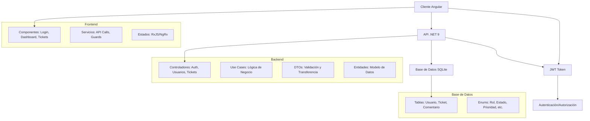
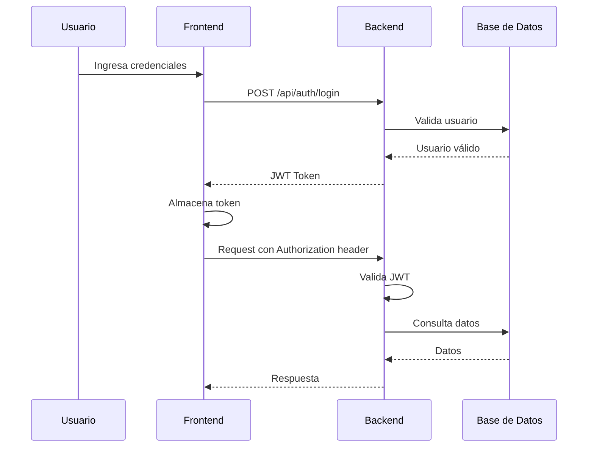

# Arquitectura del Proyecto Mesa de Ayuda

## Descripción General

Este proyecto implementa un sistema de mesa de ayuda para una empresa, compuesto por un cliente frontend desarrollado en Angular (versión 17 o superior), una API backend en .NET 9 utilizando controladores API, y una base de datos en SQLite. El sistema incluye autenticación basada en JWT y tres roles de usuario: Administrador, Técnico y Cliente.

### Objetivos del Proyecto
- Proporcionar una plataforma para que los clientes creen y sigan tickets de soporte.
- Permitir a los técnicos gestionar y resolver tickets asignados.
- Ofrecer a los administradores control total sobre usuarios y configuraciones del sistema.
- Garantizar seguridad mediante autenticación JWT y autorización basada en roles.
- Facilitar la escalabilidad y mantenibilidad del código.

## Diagrama de Arquitectura de Alto Nivel



## Esquema de Base de Datos SQLite

El esquema de base de datos se define utilizando Entity Framework Core con migraciones. A continuación se detalla cada tabla con sus campos, claves primarias, foráneas y restricciones.

### Tabla: Usuario (Esquema: MesaDeAyuda)
| Campo | Tipo | Restricciones | Descripción |
|-------|------|--------------|-------------|
| Rut | TEXT(12) | PK, NOT NULL | Identificador único del usuario (formato RUT chileno) |
| Nombre | TEXT(100) | NOT NULL | Nombre completo del usuario |
| Email | TEXT(100) | NOT NULL, UNIQUE, EMAIL | Correo electrónico del usuario |
| Rol | INTEGER | NOT NULL | Rol del usuario (1=Administrador, 2=Técnico, 3=Cliente) |
| Contrasenia | TEXT(100) | NULLABLE | Contraseña hasheada (solo para login) |
| FechaCreacion | TEXT | NOT NULL | Fecha de creación del usuario |

### Tabla: Ticket
| Campo | Tipo | Restricciones | Descripción |
|-------|------|--------------|-------------|
| Id | INTEGER | PK, AUTOINCREMENT, NOT NULL | Identificador único del ticket |
| Tipo | INTEGER | NOT NULL | Tipo de ticket (1=Incidente, 2=Requerimiento, 3=Consulta) |
| Prioridad | INTEGER | NOT NULL | Prioridad del ticket (1=Baja, 2=Media, 3=Alta) |
| Area | INTEGER | NOT NULL | Área afectada (1=Calidad, 2=Desarrollo, etc.) |
| Estado | INTEGER | NOT NULL | Estado actual (1=Abierto, 2=Revisión, 3=Resuelto) |
| Descripcion | TEXT(100) | NOT NULL | Breve descripción del problema |
| Observaciones | TEXT(500) | NOT NULL | Detalles adicionales |
| UsuarioRutCreador | TEXT(12) | FK a Usuario.Rut, NOT NULL | Usuario que creó el ticket |
| FechaCreacion | TEXT | NOT NULL | Fecha de creación del ticket |
| UsuarioRutTecnico | TEXT(12) | FK a Usuario.Rut, NULLABLE | Técnico asignado (solo para Técnicos) |
| FechaResolucion | TEXT | NULLABLE | Fecha de resolución (solo cuando Estado=Resuelto) |

### Tabla: Comentario (Propuesta - No implementada aún)
| Campo | Tipo | Restricciones | Descripción |
|-------|------|--------------|-------------|
| Id | INTEGER | PK, AUTOINCREMENT, NOT NULL | Identificador único del comentario |
| TicketId | INTEGER | FK a Ticket.Id, NOT NULL | Ticket al que pertenece el comentario |
| UsuarioRut | TEXT(12) | FK a Usuario.Rut, NOT NULL | Usuario que hizo el comentario |
| Contenido | TEXT(1000) | NOT NULL | Texto del comentario |
| FechaCreacion | TEXT | NOT NULL | Fecha del comentario |

### Enums Utilizados
- **Rol**: Administrador=1, Técnico=2, Cliente=3
- **Tipo**: Incidente=1, Requerimiento=2, Consulta=3
- **Prioridad**: Baja=1, Media=2, Alta=3
- **Estado**: Abierto=1, Revisión=2, Resuelto=3
- **Area**: Calidad=1, Desarrollo=2, Finanzas=3, Logística=4, Mantención=5, Producción=6, RRHH=7, Ventas=8

### Relaciones
- Usuario 1:N Ticket (creados)
- Usuario 1:N Ticket (asignados como técnico)
- Ticket 1:N Comentario (propuesto)

## Especificaciones de la API en .NET 9

La API se estructura en controladores RESTful con autenticación JWT y autorización basada en roles. Utiliza DTOs para validación y transferencia de datos.

### Controladores Principales

#### 1. AuthController
Maneja autenticación y tokens JWT.

| Endpoint | Método | Parámetros | Respuesta | Autorización | Lógica |
|----------|--------|------------|-----------|--------------|--------|
| `/api/auth/login` | POST | `LoginDto { Rut, Contrasenia }` | `200: { Token, RefreshToken, Usuario }` | Ninguna | Valida credenciales, genera JWT |
| `/api/auth/refresh` | POST | `RefreshTokenDto { Token, RefreshToken }` | `200: { Token, RefreshToken }` | Token válido | Renueva tokens |
| `/api/auth/logout` | POST | Ninguno | `200: OK` | Token válido | Invalida token (blacklist) |

#### 2. UsuariosController
Gestión de usuarios (solo Administrador).

| Endpoint | Método | Parámetros | Respuesta | Autorización | Lógica |
|----------|--------|------------|-----------|--------------|--------|
| `/api/usuarios` | GET | Query: page, size, search | `200: List<UsuarioResponseDto>` | Admin | Lista usuarios con paginación |
| `/api/usuarios/{rut}` | GET | Path: rut | `200: UsuarioResponseDto` | Admin | Obtiene usuario específico |
| `/api/usuarios` | POST | Body: `UsuarioCreateDto` | `201: UsuarioResponseDto` | Admin | Crea nuevo usuario |
| `/api/usuarios/{rut}` | PUT | Path: rut, Body: `UsuarioUpdateDto` | `200: UsuarioResponseDto` | Admin | Actualiza usuario |
| `/api/usuarios/{rut}` | DELETE | Path: rut | `204: No Content` | Admin | Elimina usuario |

#### 3. TicketsController
Gestión de tickets con permisos por rol.

| Endpoint | Método | Parámetros | Respuesta | Autorización | Lógica |
|----------|--------|------------|-----------|--------------|--------|
| `/api/tickets` | GET | Query: page, size, filters | `200: List<TicketResponseDto>` | Cliente/Técnico/Admin | Lista tickets (Cliente: solo suyos, Técnico: asignados, Admin: todos) |
| `/api/tickets/{id}` | GET | Path: id | `200: TicketResponseDto` | Propietario/Técnico/Admin | Obtiene ticket específico |
| `/api/tickets` | POST | Body: `TicketCreateDto` | `201: TicketResponseDto` | Cliente | Crea nuevo ticket |
| `/api/tickets/{id}` | PUT | Path: id, Body: `TicketUpdateDto` | `200: TicketResponseDto` | Técnico/Admin | Actualiza ticket (estado, asignación) |
| `/api/tickets/{id}/asignar` | PUT | Path: id, Body: { tecnicoRut } | `200: OK` | Admin | Asigna técnico a ticket |
| `/api/tickets/{id}/resolver` | PUT | Path: id | `200: OK` | Técnico asignado | Marca ticket como resuelto |

#### 4. ComentariosController (Propuesto)
Gestión de comentarios en tickets.

| Endpoint | Método | Parámetros | Respuesta | Autorización | Lógica |
|----------|--------|------------|-----------|--------------|--------|
| `/api/tickets/{id}/comentarios` | GET | Path: id | `200: List<ComentarioDto>` | Participantes del ticket | Lista comentarios |
| `/api/tickets/{id}/comentarios` | POST | Path: id, Body: `ComentarioCreateDto` | `201: ComentarioDto` | Participantes del ticket | Agrega comentario |

### DTOs Principales
- **LoginDto**: Rut, Contrasenia
- **UsuarioCreateDto**: Nombre, Email, Rol, Contrasenia
- **UsuarioUpdateDto**: Nombre, Email, Rol
- **UsuarioResponseDto**: Rut, Nombre, Email, Rol, FechaCreacion
- **TicketCreateDto**: Tipo, Prioridad, Area, Descripcion, Observaciones
- **TicketUpdateDto**: Estado, Observaciones, UsuarioRutTecnico
- **TicketResponseDto**: Id, Tipo, Prioridad, Area, Estado, Descripcion, Observaciones, UsuarioRutCreador, FechaCreacion, UsuarioRutTecnico, FechaResolucion

### Manejo de Errores
- `400 Bad Request`: Validación fallida
- `401 Unauthorized`: Token inválido o expirado
- `403 Forbidden`: Permisos insuficientes
- `404 Not Found`: Recurso no encontrado
- `500 Internal Server Error`: Error del servidor

## Estructura del Frontend en Angular

El frontend se organiza en módulos, componentes, servicios y guards para una arquitectura escalable.

### Módulos Principales
- **AuthModule**: Login, registro (solo admin)
- **DashboardModule**: Panel principal con métricas
- **TicketsModule**: Lista, creación, detalle de tickets
- **UsersModule**: Gestión de usuarios (solo admin)
- **SharedModule**: Componentes reutilizables

### Componentes Principales
- **LoginComponent**: Formulario de autenticación
- **DashboardComponent**: Vista general con estadísticas
- **TicketListComponent**: Lista de tickets con filtros
- **TicketCreateComponent**: Formulario para crear ticket
- **TicketDetailComponent**: Vista detallada con comentarios
- **UserManagementComponent**: CRUD de usuarios (admin)
- **ProfileComponent**: Perfil del usuario actual

### Servicios
- **AuthService**: Manejo de login, logout, tokens
- **TicketService**: CRUD de tickets
- **UserService**: Gestión de usuarios
- **NotificationService**: Manejo de notificaciones (propuesto)

### Guards
- **AuthGuard**: Protege rutas autenticadas
- **RoleGuard**: Verifica permisos por rol
- **AdminGuard**: Solo para administradores

### Manejo de Estados
Utiliza RxJS para manejo reactivo de estados. Para estados complejos, se puede integrar NgRx:
- Estado de autenticación
- Lista de tickets con filtros
- Usuario actual

### Rutas Protegidas
```typescript
const routes: Routes = [
  { path: 'login', component: LoginComponent },
  { path: 'dashboard', component: DashboardComponent, canActivate: [AuthGuard] },
  { path: 'tickets', component: TicketListComponent, canActivate: [AuthGuard] },
  { path: 'tickets/create', component: TicketCreateComponent, canActivate: [AuthGuard, RoleGuard], data: { roles: ['Cliente'] } },
  { path: 'users', component: UserManagementComponent, canActivate: [AuthGuard, AdminGuard] },
  // ...
];
```

## Flujo de Autenticación y Autorización

### Generación y Validación de JWT
1. Usuario envía credenciales (RUT + contraseña) al endpoint `/api/auth/login`
2. Backend valida credenciales contra BD (contraseña hasheada con bcrypt)
3. Si válido, genera JWT con claims: Rut, Nombre, Rol, exp
4. Frontend almacena token en localStorage/sessionStorage
5. Para cada request, incluye `Authorization: Bearer {token}` en headers
6. Backend valida token en middleware JWT, extrae claims para autorización

### Permisos por Rol
- **Cliente**: Crear tickets, ver/editar propios tickets
- **Técnico**: Ver tickets asignados, actualizar estado, agregar comentarios
- **Administrador**: Todos los permisos + gestión de usuarios

### Manejo de Sesiones
- Tokens expiran en 1 hora
- Refresh tokens para renovación automática
- Logout invalida tokens (opcional: blacklist en BD/Redis)



## Funcionalidades Específicas

### Creación y Asignación de Tickets
- Clientes crean tickets especificando Tipo, Prioridad, Área, Descripción, Observaciones
- Sistema asigna automáticamente a técnico disponible (propuesto: round-robin)
- Admins pueden reasignar manualmente

### Estados y Transiciones
- **Abierto** → **Revisión** (Técnico asignado)
- **Revisión** → **Resuelto** (Técnico resuelve)
- Solo Admins pueden reabrir tickets resueltos

### Comentarios y Comunicación
- Técnicos y Clientes pueden agregar comentarios en tickets
- Notificaciones por email cuando hay actualizaciones (propuesto)

### Filtros y Búsquedas
- Por estado, prioridad, área, fecha
- Búsqueda por texto en descripción/observaciones
- Paginación para listas grandes

### Validaciones de Negocio
- Solo Admins crean usuarios
- Clientes no pueden asignar técnicos
- Técnicos solo ven tickets asignados
- Tickets requieren descripción y área

## Consideraciones Técnicas

### Versiones de Dependencias
- **Backend**: .NET 9, Entity Framework Core 9, SQLite 3
- **Frontend**: Angular 20, RxJS 7, TypeScript 5.9
- **Base de Datos**: SQLite (desarrollo), SQL Server (producción propuesta)

### Configuración de CORS
- Origins: localhost:4200 (desarrollo), dominio producción
- Headers: Authorization, Content-Type
- Methods: GET, POST, PUT, DELETE

### Manejo de Errores
- Global exception handler en backend
- Interceptores HTTP en frontend para errores 401/403
- Logging con Serilog

### Pruebas Unitarias
- xUnit para backend
- Jasmine/Karma para frontend
- Cobertura mínima 80%

### Despliegue
- **Desarrollo**: dotnet run, ng serve
- **Producción**: IIS/Docker para backend, Nginx para frontend
- CI/CD con GitHub Actions

## Instalación y Configuración Inicial

### Prerrequisitos
- .NET 9 SDK
- Node.js 18+
- Angular CLI 20

### Backend
```bash
cd backend
dotnet restore
dotnet ef database update
dotnet run
```

### Frontend
```bash
cd client
npm install
ng serve
```

### Configuración
- Actualizar `appsettings.json` con cadena de conexión SQLite
- Configurar JWT secret en variables de entorno
- Ejecutar migraciones: `dotnet ef database update`

## Información Adicional

### Suposiciones
- RUT como identificador único (válido para Chile)
- No se requiere multi-tenancy inicialmente
- Notificaciones por email (propuesto, no implementado)

### Decisiones de Diseño
- Enums en BD como integers para performance
- DTOs separados para create/update/response
- JWT stateless (sin invalidación server-side)
- SQLite para simplicidad en desarrollo

### Posibles Extensiones
- Notificaciones push/email
- Dashboard con métricas avanzadas
- API de reportes
- Integración con sistemas externos
- Multi-idioma
- Auditoría de cambios

### Mantenimiento
- Logs centralizados
- Monitoreo con Application Insights
- Documentación API con Swagger
- Versionado semántico

Este documento sirve como guía completa para el desarrollo, mantenimiento y escalabilidad del proyecto Mesa de Ayuda.